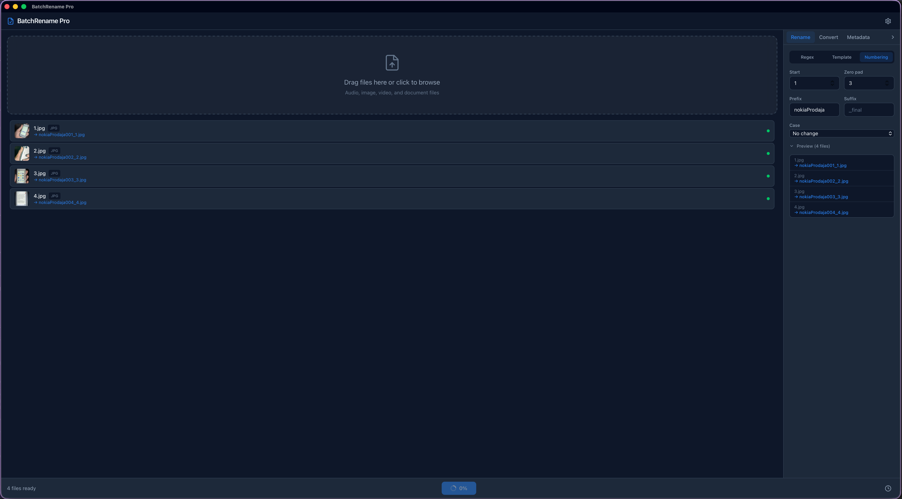

# BatchRename Pro

A fast, native desktop app for batch file renaming, format conversion, and metadata editing. Built with Tauri 2, React 19, and Rust.


---

## Features

**Rename** files in bulk with three powerful modes:
- **Regex** find-and-replace with live preview
- **Template** patterns using `{original}`, `{number}`, `{date}`, `{ext}`
- **Sequential numbering** with configurable start, padding, prefix, and suffix

**Convert** between formats:
- Images: JPG, PNG, WebP, AVIF, BMP, GIF, TIFF (pure Rust, no external deps)
- Audio/Video: planned (ffmpeg integration)

**Edit metadata:**
- Read and write ID3v2 tags (title, artist, album, year, track, genre)
- View EXIF data from images
- Bulk strip all metadata with one click

**Built for speed:**
- Rayon parallel processing across all CPU cores
- Virtualized file list handles 5,000+ files
- Backup-before-write with full undo support
- SQLite WAL mode for fast job history with FTS5 search

---

## Screenshot



---

## Getting Started

### Prerequisites

- [Node.js](https://nodejs.org/) 20+
- [Rust](https://www.rust-lang.org/tools/install) stable 1.75+
- Platform-specific Tauri dependencies:

**macOS:**
```bash
xcode-select --install
```

**Linux (Arch):**
```bash
sudo pacman -S webkit2gtk-4.1 base-devel curl wget file openssl appmenu-gtk-module gtk3 libappindicator-gtk3 librsvg
```

**Linux (Debian/Ubuntu):**
```bash
sudo apt install libwebkit2gtk-4.1-dev build-essential curl wget file libssl-dev libayatana-appindicator3-dev librsvg2-dev
```

### Install and Run

```bash
git clone https://github.com/salvadalba/nodaysidle-batchrenamepro.git
cd nodaysidle-batchrenamepro
npm install
npm run tauri dev
```

### Build for Production

```bash
npm run tauri build
```

The built app will be in `src-tauri/target/release/bundle/`.

---

## Architecture

```
nodaysidle-batchrenamepro/
├── src/                    # React 19 + TypeScript frontend
│   ├── components/         # UI components (FileList, RenameTab, etc.)
│   ├── hooks/              # Custom hooks (useTauriEvent, useRenamePreview)
│   ├── lib/                # IPC command wrappers
│   ├── state/              # useReducer + Context state management
│   └── types.ts            # Shared TypeScript types
├── src-tauri/              # Rust backend
│   └── src/
│       ├── commands.rs     # Tauri IPC command handlers
│       ├── pipeline.rs     # Batch processing engine (Rayon)
│       ├── preview_service.rs  # Rename preview engine
│       ├── metadata_service.rs # ID3 + EXIF operations
│       ├── conversion_service.rs # Format conversion
│       ├── db.rs           # SQLite + FTS5 database
│       ├── file_service.rs # File validation
│       └── types.rs        # Shared Rust types (serde)
└── package.json
```

### Tech Stack

| Layer | Technology |
|-------|-----------|
| Frontend | React 19 + TypeScript + Tailwind CSS 4 |
| Bundler | Vite 6 |
| Backend | Rust + Tauri 2 |
| Database | SQLite (rusqlite) with WAL mode + FTS5 |
| Parallelism | Rayon |
| Image processing | `image` crate (pure Rust) |
| Audio metadata | `id3` crate |
| Image metadata | `kamadak-exif` crate |

---

## Keyboard Shortcuts

| Action | Shortcut |
|--------|----------|
| Open file picker | Drag & drop or click drop zone |
| Apply transformation | Click Apply button |
| Undo last operation | Click Undo |
| Open settings | Gear icon in navbar |
| View history | Clock icon in footer |

---

## Development

```bash
# Frontend only (hot reload)
npm run dev

# Rust type check
cd src-tauri && cargo check

# Run Rust tests
cd src-tauri && cargo test

# TypeScript type check
npx tsc --noEmit
```

---

## License

MIT

---

Built with Tauri, React, and Rust. Desktop-first, no cloud required.
